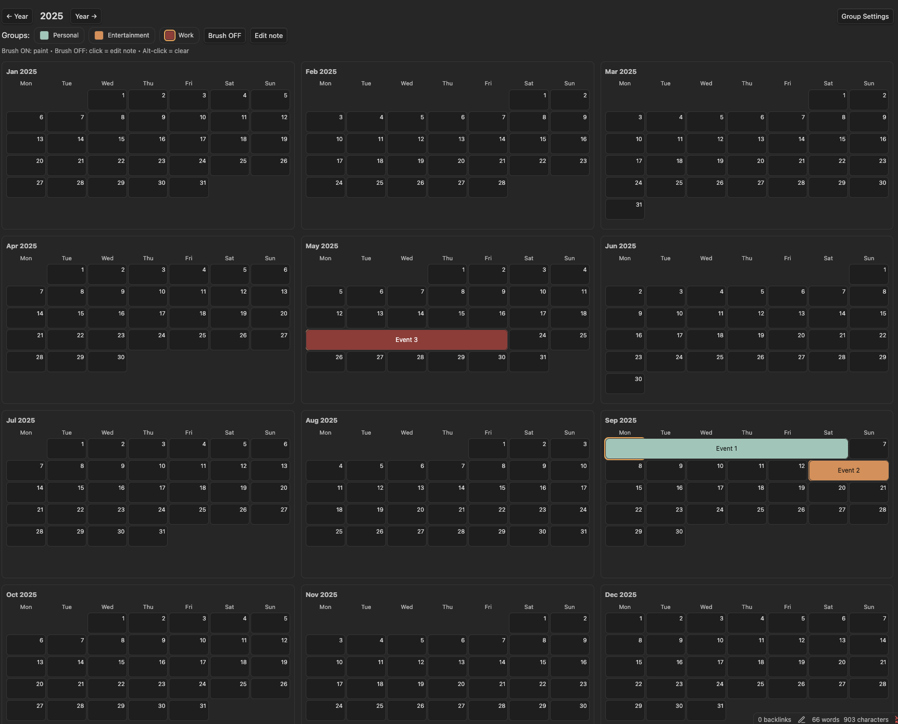

# Year Planner

A yearly calendar plugin for [Obsidian](https://obsidian.md).

## Features

- Full year view in 3×4 months grid
- Paint days with group colors
- Inline notes (hover tooltips + pill segments)
- Alt-click to clear a day
- Group settings with cascading recolor

## Installation

### Manual
1. Clone this repo into your vault's `.obsidian/plugins/` folder:
   ```bash
   git clone https://github.com/Eukary0te/obsidian-year-planner
   cd obsidian-year-planner
   npm install
   npm run build